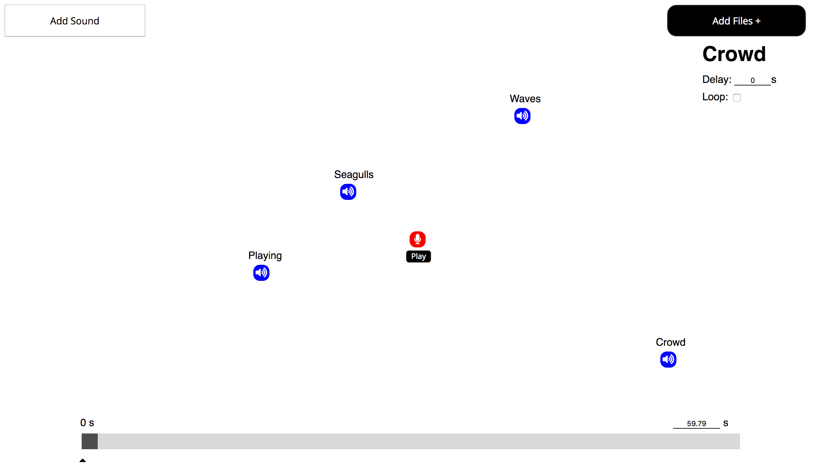

# Sound Escape

  Sound Escape is a tool that allows you to turn regular sound files into a 3D audio environment. By dragging your sound files into the environment and positioning them around the listener, the sounds will appear to surround you.

## Inspiration
Back when we were kids, there was this video called the "Virtual Barber Shop" that blew our minds.

https://www.youtube.com/watch?v=IUDTlvagjJA

The video made you feel like Luigi was right behind you, cutting your hair. Fast forward ten years, we somehow came across the video again and wanted to experiment with 3D audio ourselves. However, as broke college students, we weren't about to drop a thousand dollars for a 3D mic. 

## What's Next
1. Animation & Keyframes of position
2. Export Audio file as MP4 download
3. Auth to save soundscapes
4. More controls over properties such as fade